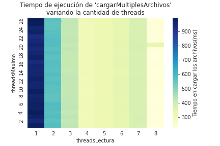

Threading y concurrencia: hashmap

# Introducción:
Con los resultados del paper "Optimizing power using transformations” escrito en 1995. Sabemos para ejectuar alguna tarea, el uso de muchos cores sencillos pueden pueden tener un consumo menor (con respecto a la candidad de watts) a un super procesador. Utilizar muchos cores sencillos trae el desfio de sincronizar distintos threads o procesos.

Para estudiar las desventajas y dificultades que trae la concurrencia implementaremos una estructura de datos con distintos metodos que tendran capacidad de ejecutarse en paralelo. 

Resolución del TP.
la estructura a implementar se trata una tabla de _hash_ abierta que gestiona las colisiones utilizando listas enlazadas. Su interfaz de uso es la de un _map_ o diccionario, cuyas claves serán _strings_ y sus valores, enteros no negativos. La idea es poder aplicar esta estructura para procesar archivos de texto contabilizando la cantidad de apariciones de palabras (las claves serán las palabras y los valores, su cantidad de apariciones).


Así mismo, analizaremos las ventajas y limitaciones de implementar una estrucutra de datos con estas carácterísitcas.

# Implementación de la estructura

## ListaAtomica:

En primera instancia, se requirió implementar la lista enlazada de manera tal que esta soporte _multithreading_ a la hora de insertar un nuevo elemento.

_(1)_ Que la lista sea atómica significa que sus operaciones pueden ejecutarse concurrentemente sin incurrir en condiciones de carrera (_race conditions_). Esto significa que, para cualquier scheduler (mínimamente razonable), el resultado de sus operaciones se corresponderá a una sucesión de llamados de funciones de distintos threads.

Usar esta lista no garantiza que el usuario no incurra en problemas de concurrencia por dos motivos:
1. Pues otras secciones de su código podrían estar mal implementadas.
2. No todos los métodos de esta lista son atómicos. Por ejemplo, el método `T& cabeza()` definido de la siguiente manera:
```c
T& cabeza() const {
    return _cabeza.load()->_valor; 
}
```
Este método es equivalente al siguiente:
```c
T& cabeza() const {
    Nodo* temp = _cabeza.load()
    return temp->valor; 
}
```
Luego, si se inserta un elemento entre la instrucción `load` y el `return`, el método devolvería un resultado incorrecto.

A diferencia del método `cabeza()`, nuestra implementación del método `insertar` utiliza un `mutex` para asegurarse que solo un thread pueda acceder y modificar la cabeza de la lista en cada momento. De esta menera nos aseguramos que no haya problemas de concurrencia y que el método sea atómico.

## HashMapConcurrente:
Por otra parte, el _HashMapConcurrente_ debe proveer los siguientes métodos:
- `void incrementar(string clave)`: Dada una clave, si esta existe se debe incrementar su valor por 1. Caso contrario, se debe agregar la tupla `<clave, 1>` al final de la lista enlazada determinada por la función de _hash_.
- `vector<string> claves()`: Se debe devolver un vector con todas las claves dentro del diccionario.
- `unsigned int valor(string clave)`: Dada una clave, se debe devolver el valor asociada a esta.

Así mismo, había ciertas restricciones impuestas del punto de vista de la concurrencia:
- Además de soportar _multithreading_, el método `incrementar` debía proveer contención únicamente en el caso de que exista una colisión de _hash_. 
- El método `claves` debe ser no bloqueante y libre de espera. Así mismo, debe permitir ejecutarse concurrentemente con el método `valor`.
- Al igual que el método `claves`, el método `valor` debe ser no bloqueante y libre de espera.

Podían producirse condiciones de carrera en el caso que, mientras se estaba ejecutando un método de lectura, ya sea `Claves` o `Valor`, el _scheduler_ diera prioridad a un llamado al método `Incrementar` o viceversa. Esto se debe a que, en el caso de `Claves`, el método `Incrementar` podría crear una nueva clave en una posición ya recorrida por el método, provocando de esta manera un resultado inconsistente. En el caso del método `Valor`, análogamente a `Claves`, el método `Incrementar` podría modificar el valor de la clave solicitada, luego de que se haya leído.

Para evitar que se produzcan este tipo de problemas, decidimos orientar nuestra implementación al problema clásico _readers & writer_, pero permitiendo más de un escritor en la sección crítica. Esto lo podemos permitir ya que, dentro del método `Incrementar` volvemos a exigir una exlcusión mutua con respecto a la fila a escribir.

La idea principal es tener un _mutex_ `room_empty` que notifique que rol (_reader_ o _writer_) tiene acceso a la sección crítica. Este se asigna al primero que pida acceso a la sección crítica, y solo habilita el cambio de roles cuando el último proceso con ese rol abandona la sección crítica. En otras palabras, utilizamos un _Lightswitch_:
```c
mutex_readers.wait();
    // Contabilizamos atómicamente la cantidad de lectores en la sección crítica.
    readers += 1;

    // Si se trata del primero de su rol, espera a tener control de la sección crítica.
    // Si no, pasa diréctamente a la sección crítica.
    if (readers == 1):
        room_empty.wait();
mutex_readers.signal();
```
A la hora de salir de la sección crítica, el último proceso del determinado rol es quien se encarga de ceder el control:
```c
mutex_readers.wait();
    // Contabilizamos atómicamente la cantidad de lectores en la sección crítica.
    readers -= 1;

    // Si se trata del último de su rol, cede el control de la sección crítica.
    // Si no, sale de la seción crítica sin cambios.
    if (readers == 0):
        room_empty.signal();
mutex_readers.signal();
```
En la solución original del problema, solamente un proceso con rol del ecritore podía acceder a la sección crítica. Implementado de esa manera, estaríamos perdiendo la posibilidad de paralelizar el método `Incrementar`, ya que la escritura a distintos índices de la tabla no genera _race conditions_. Así mismo, nuestra implementación debía permitir que los métodos de lectura se puedan ejecutar concurrentemente, y tengan prioridad por sobre las escrituras. Para esto, utilizamos _turnstiles_ o «molientes» que, bajo un _scheduler_ mínimamente razonable, eventualmente le dan la prioridad a las métodos de lectura bloqueando la llegada de nuevas escrituras evitando asi las posible inanción causada por una llegada sucesiva de escrituras no puedan causarle inanción nunca cediendo el control del `room_empty`. No obstante, esto podŕia causar inanciíon para la escritura, ya que no libera las escrituras de su molinete hasta que cede el control de `roopm_empty`, pero no tenemos ninguna restricción con respecto a `Incrementar`.

En el caso del método `Valor`, la race condition se da por índice de tabla. Por esto tenemos las mismas primitivas que para el método de `Claves` pero asociado a cada una de las filas. Esto permite, poder ejecutar un `Incrementar` y un `Valor` concurrentemente en caso de que operen sobre filas distintas.
- En principio no simetrica

MAXIMO;
Como el método `Maximo` recorre las listas atómicas, es posible que no considere un nodo ya visitado que pueda convertirse en el máximo luego de una llamada al méotodo `Incrementar`. En definitiva, `Maximo` es una operación de lectura, e `Incrementar` una de escritura, el resultado de una mala sincronización entre estos es que arrojen resutlados no consistentes.

Supongamos una lista donde hay únicamente un elemento cuyo valor es 1. Como es el primer elemento que considera, este toma el rol de máximo en la lista. Antes de considerar al próximo elemento, se ejecutan y finalizan 4 llamados al método `Incrementar`: Dos para el primero, llevando su valor a 3, y dos para un nuevo elemento, llevand su valor a 2. Notemos que en ningún momento este nuevo elemento fue el máximo de la lista, pero como no se vuelve a considerar el nodo ya visitado, el máximo pasa a ser este nuevo nodo. Máximo en este caso devolvería el nuevo nodo con su valor: 2.

Como máximo es así mismo una operación de lectura, la lógica de sincronizaciṕon es exáctamente igual a la utilzada en el método `Claves`.

## CargarArchivos
- No fue necesario tomar ningún recaudo desde el punto de vista de sincronización ya que, el método `cargarArchivos` simplemente llamaba al método `Incrementar` del HashMap, y este ya se encarga de eso.
- Decidimos pasar como parámetro a los threads un int atómico que haga referencia al índice del último archivo que fue llamado a procesar. De esta manera, guardando este índice, un mismo thread ciclaba hasta que este índice indicase que todos los archivos fueron procesados. De esta manera, solo hace falta crear la cantidad de threads requerida, una sola vez. Así mísmo, pasamos los nombres de los archivos en un vector. Como los threads solo hacen lecturas sobre este vector, no es necesario regularlos con un mutex.

# Experimentación


Queríamos poner a prueba qué ventajas y limitaciones tenía la concurrencia en nuetstra estrctura.
Para ello, decidimos basar nuestros experimentos sobre dos aspectos de nuestra implementación y proponer experimentos que los pongan a prueba:

Establecimos reglas para nuestra experimentación:
- Para el método de `MáximoParalelo`, decidimos no experimentar usando más threads que la cantidad de listas de la tabla. Estos no aportarían nada intersante por como está implementado nuestro método.
- Para el método `CargarMultiplesArchivos`, decidimos no ejecutarlo con más threads que el número de archivos a cargar. Por el mismo motivo que antes.

## Encontrar elemento máximo en la tabla
La idea era sacar algún tipo de conclusión acerca de las ventajas y limitaciones que tiene implementar una estructura de datos que permita concurrencia. ¿Es siempre cierto que a mayor cantidad de threads mayor la eficiencia? o Hay un punto en el que el _overhead_ termina siendo un detrimento hacia la _performance_ del proceso. Estoas preguntas son sobre las que queríamos experimentar. Un detalle también, decidimos limitar la cantidad de threads a 26 ya que, dada nuestra implementación, es claro que no arrojaría ningún resultado útil ya que no hacen nada los threads sobrantes.
Luego, proponemos medir el tiempo que tarda en ejecutar el método `MaximoParalelo` sobre una tabla con 105000 palabras cuyas primeras letras cuyas primeras letras están uniformemente distrubuídas, de manera tal que recorrer cualquiera de las listas atómicas demore aproximadamente lo mismo. Así mismo, proponemos registrar los cambios en estos tiempos producidos por variaciones en la cantidad de threads utilizados.
Esperamos que hasta cierto punto, aumentar la cantidad de _threads_ utilizados disminuya el tiempo requerido para encontrar el elemento máximo, pero hasta cierto punto. Suopnemos que, a partir de este punto, el _overhead_ requerido para gestionar todos estos _threads_ será demasiado y en sí, los _threads_ harán muy poco progreso, y terminarán afectando a la performance del método en general.

## Tiempo de ejecución para cargar multiples archivos:
La idea de este experimento será medir el efecto sobre el tiempo de ejecución del método `CargarMultiplesArchivos` que producen los threads. Al igual que el experimento anterior, nos interesa saber si es siempre beneficioso incorporar más threads al proceso o si existe algún tipo de limitación. También, si depende de la cantidad de archivos que se pretenden cargar.
Proponemos medir el tiempo de ejecución del método primero con una cantidad fija de archivo, 20, y luego variando tanto cantidad de threads como cantidad de archivos.
Al igual que en el experimento anterior, proponemos ciertas restricciones acerca de los parámetros que iremos modificando: La cantidad de threads no puede superar la cantidad de archivos a cargar. Esto por el simple motivo de que, por la implementación de nuestro mpetodo, esto no arrojaría ningpun resultado intersaante y solo ocuparían tiempod eprocesamiento innecesariamente.
Muy similar al experimento anterior, esperamos que exista un punto de quiebre con respecto al tiempo de ejecución del método variando la cantidad de threads utilizados. En un aprimera instancia, esperamos que siempre sea beneficioso, pero cuando el _overhead_ de lanzar threads sea más significativo, este afectará el rendimiento del méotodo en general.

# Resultados y discusión
## Maximo

## CargarArchivos


CPU donde se corrieron los experimentos:
|           A           |          B        |
|-----------------------|-------------------|
|   Architecture:       |   x86_64          |
|   CPU op-mode(s):     |   32-bit, 64-bit  |
|   Byte Order:         |   Little Endian   |
|   Address sizes:      |   48 bits physical, 48 bits virtual   |
|   CPU(s):             |   6   |
|   On-line CPU(s) list:|   0-5 |
|   Thread(s) per core: |   2   |
|   Core(s) per socket: |   3   |
|   Socket(s):          |   1   |
|   NUMA node(s):       |   1   |
|   Model name:         |   AMD FX(tm)-6100 Six-Core Processor  |
|   CPU MHz:            |   3229.762    |
|   CPU max MHz:        |   3300        |
|   CPU min MHz:        |   1400        |
|   BogoMIPS:           |   6630.02     |
|   L1d cache:          |   48 KiB      |
|   L1i cache:          |   192 KiB     |
|   L2 cache:           |   6 MiB       |
|   L3 cache:           |   8 MiB       |

Memoria RAM: 
### insertar datos de la memoria ram

Seteamos como cantidad máxima de threads para nuestros experimentos los siguientes valores:
- `MaximoThreads`: 26
- `CargarArchivos`: #archivos.

Conlcuímos que no tiene muhco sentido analizar los casos donde literalmento los threads no hacen nada.
Lo interesante es ver cuando, supuestamente piodrían hacer algo estos threads, debido al scheduler, etc,
terminan afectando negativamente la performance.

# Conclusión
